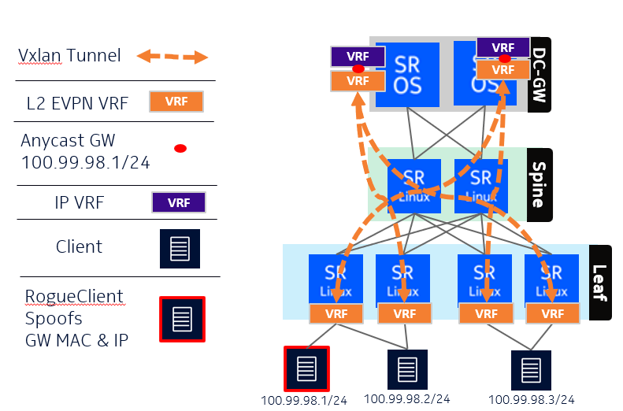

# EVPN-VXLAN Interworking Lab



This lab demonstrates **EVPN-VXLAN interworking** between **SR Linux–based 7720 IXR** leaf/spine switches and an **SROS-based 7750 SR-1** functioning as the **Data Center Gateway (DCGW)**.

A **Layer 2 EVPN (MAC-VRF)** extends from the leaf switches to the DCGWs. **Spines** act purely as IP routers, forwarding VXLAN tunnels without participating in EVPN signaling.

Each DCGW hosts a **Layer 3 VRF (VPRN)** with an **IRB interface** connected to the L2 EVPN instance (MAC-VRF on SR Linux / VPLS on SROS).

Both DCGWs share a common **gateway IP** using **passive VRRP** (VRRP without signaling).

- **Anycast Gateway IP:** `100.99.98.1`  
- **Client 1:** `100.99.98.2`  
- **Client 2:** `100.99.98.3`  
- **Rogue Client:** Spoofs the gateway’s IP and MAC

Because **proxy-ARP** is active and the **gateway MAC/IP** is advertised as **EVPN-static**, spoofing attempts fail. The network always prefers the legitimate gateway entry and ignores rogue traffic. The rogue MAC is never learned, and its IP is excluded from EVPN due to overlap with the gateway.  
This protects the EVPN fabric from **spoofing** and **misconfiguration**.

---

## Deployment Guide

### System Requirements
- Linux host with **16 GB RAM** and **8 vCPUs** (minimum)
- Installed: **Docker**, **Containerlab**, **Git**

### Install Dependencies

# Install or upgrade Containerlab
```bash
curl -sL https://containerlab.dev/setup | sudo -E bash -s "all"
```
# Install Docker
```bash
curl -fsSL https://get.docker.com | sh
```
# Install Git
```bash
sudo apt install git -y  # or follow https://git-scm.com/install/linux
```
# Lab Deployment Steps

# 1. Fetch the lab repository
```bash
git -C eufi pull || git clone https://github.com/kkayhan/eufi.git
```
# 2. Enter the lab directory and deploy
```bash
cd eufi
sudo clab deploy
```
# 3. Access the nodes
# When deployment completes, containerlab lists management IPs.
# SSH using node names (e.g. ssh leaf1) or the printed IPs.

# Cleanup
```bash
cd eufi
sudo clab destroy --cleanup
```